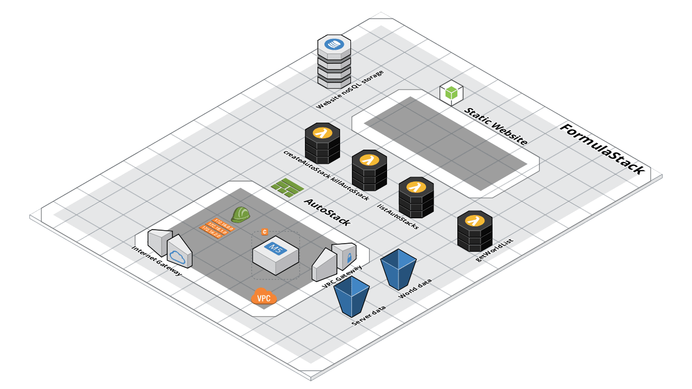

# FormulaCraft
A SMS-based service for running Minecraft server on AWS.

# ThePlan

**NOTE** that this repo is currently under construction. This is a learning process in which I will dig deeper into a few technologies, and I don't expect it to be complete for a few months.

This implementation will have two high level components. First, a AWS Cloudformation script that implements the SMS-based API for querying the status of servers being run. Second, a Cloudformation script that implements the stack for each server requested. We will work from the bottom up, hoping to develop the stack,  fully automated, first. Before the creation of this repo, significant work was done creating a working stack allowing for MCServer to run.

# Resources

## .gitignore
	- .pem, .ppk are both keys used for accessing ec2 instances through SSH on Windows.
	- .txt are almost always my own simple note files. Not necessary for understanding this repo.

## FormulaStack
	- This Cloudformation stack will generate the resources needed to run the API that will give and answer calls for Minecraft Servers. This stack should be left up for the duration of the project's use.

## AutoStack
	- This Cloudformation script will create a proprietary stack for each Minecraft Server requested through the API. These stacks will be brought up and down by the API, and will not be generated manually at all, unless for debugging purposes.
	- set up cronjob to automatically upload world over time.
	- run mineShell.
	- clean up save and close down stack...? (TODO: close down stack automation.)

# dependencies

## S3 bucket structure
	- Your S3 bucket is required to have a certain degree of organization. subfolders to include:
		- **server** - this will contain several versions of the server.jar and dependencies. You can include other mod packs, other data packs and textures, etc.
		- **world** - this will contain world folders (and possibly player folders?? we'll come back to that. Perhaps rename this to **level**)
		- **dependencies** - this is where the cronjob, mineShell, and other code will reside.

# the Stack

	- AWS Cloudformation
	- EC2 userdata for run on startup services
	- Node.js for MCServer wrapper.
	- AWS services including EC2, Lambda, SMS/SQS, etc in API implementation.

# notes

below this section, all of this is just notes for myself.

## resources
	- https://docs.aws.amazon.com/sdk-for-javascript/v2/developer-guide/setting-up-node-on-ec2-instance.html
	- similar project from Positron: https://github.com/positron/aws-minecraft
	- https://www.twilio.com/blog/2014/11/child-processes-streams-minecraft-multiplayer-server-nodejs.html
